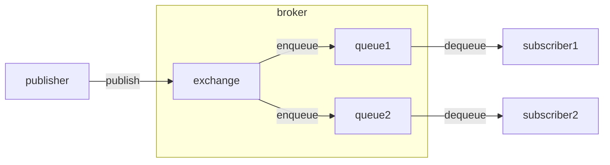

# Publish-subscribe

An example of Publish-subscribe using the RabbitMQ message broker.

> **_NOTE:_** This code assumes RabbitMQ is running as a separate process on your machine.

The example used is that of a basic building management system where sensors periodically publish data that can be consumed by other subsystems:

  * A temperature sensor acts as a *publisher* that periodically publishes temperature readings.

  * There are two *subscribers*, for example:
  
    * A sprinkler system that automatically activates sprinklers if the temperature is too high.
    
    * A monitoring server that displays a dashboard of temperature readings to a human operator.

In the example, we assume that sensors publish temperature readings under a "topic" named `temp.{sensorid}` where `{sensorid}` is replaced by the sensor's unique ID. The two subscribers each declare a queue and then "bind" the queue to an "exchange" using the topic `temp.*`. The `*` is a wildcard taht will match *any* sensor id. The sensor code publishes temperature readings to the topic `temp.sensor123` (here `sensor123` is just a hard-coded id).

## Publish-subscribe vs Event Notification

The publish-subscribe pattern is similar to the event notification pattern except:

  * In this example, the subscribers do not directly connect to the server process that is emitting the events. Instead, everyone (server and clients) connects to the same broker (RabbitMQ server). (Note that publisher and subscribers still share a configuration file storing the connection details for the shared broker and topic name.)
  
  * In this example, producer and consumers need not both be online at the same time. The publisher can enqueue the sensor readings and go offline. Subscribers may be offline when new updates are posted, and are able to read them afterwards (as long as their queue was properly declared).
  
  * If subscribers fail while processing a sensor reading, the reading will stay enqueued in the subscriber's queue and will be processed again when the subscriber recovers. The broker will store the messages on behalf of each subscriber in their own queue, so that no updates are lost (unless the broker itself fails, or the broker stores queued messages on disk).

## Learn more

The publish-subscribe pattern using RabbitMQ is explained in more detail [here](https://www.rabbitmq.com/tutorials/tutorial-three-python.html). Beware: they use a different Python client library (`pika` instead of `rabbitpy`) with a different client API.