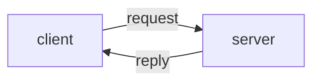

# Request-reply

Basic request-reply pattern using ZeroMQ sockets (direct communication).

The file `run.py` contains example code demonstrating a basic 'echo server'.
An 'echo server' is a process that listens for a message and then simply replies the same message to the sender.

In our example, the server listens on a TCP port for any message, reads the message and adds a '!' suffix (just so that we can easily tell the difference between the request and the reply message), and then sends the updated string back to the sender.

The script `run.py` programmatically launches both client and server as sub-processes of a single parent process.

We use ZeroMQ's "request" and "reply" socket types to facilitate the communication.

## ZeroMQ sockets versus standard TCP/IP sockets

It is useful to compare this example to the example in `python_basics/sockets` which uses standard TCP/IP sockets rather than ZeroMQ. As in the Sockets example, both server and client process create a socket and bind it to a host and port.

Unlike with basic TCP sockets, in ZeroMQ:

  * The server does not need to separately call `listen` and `accept`.
  * The processes must not explicitly close the connection.
  * The library provides a range of supported message encodings.
  * The byte stream is automatically chunked into discrete messages (hiding implementation details such as byte buffer sizes etc.)

