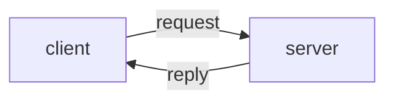

# Request-reply

Basic request-reply pattern using ZeroMQ sockets (direct communication).



The files `client.py` and `server.py` contain example code demonstrating a basic 'echo server'.

An 'echo server' is a process that listens for any message and then simply replies to the sender with the same message.

In our example, the server listens on a TCP port for any message to arrive, reads the message and adds a '!' suffix (just so that we can easily tell the difference between the request and the reply message), and then sends the updated message string back to the sender.

We use ZeroMQ's "request" and "reply" socket types to facilitate this pattern of bidirectional communication.

## Running the code

In one terminal (or shell), run:

```
% python3 server.py
```

In another terminal, run:

```
% python3 client.py
```

The output should be:

```
% python3 server.py
received: b'Hello world'

% python3 client.py
Hello world!
```

Alternatively, the script `run.py` launches both the client and server process as sub-processes of a single parent process. You then see the client and server output interleaved in the same terminal:

```
% python3 run.py
received: b'Hello world'
Hello world!
```

## ZeroMQ sockets versus standard TCP/IP sockets

It is useful to compare this example to the example in `python_basics/sockets` which uses standard TCP/IP sockets rather than ZeroMQ. As in the Sockets example, both server and client process create a socket and bind it to a host and port.

Unlike with basic TCP sockets, in ZeroMQ:

  * The server does not need to separately call `listen` and `accept`.
  * The processes must not explicitly close the connection.
  * The library provides a range of supported message encodings.
  * The byte stream is automatically chunked into discrete messages (hiding implementation details such as byte buffer sizes etc.)

