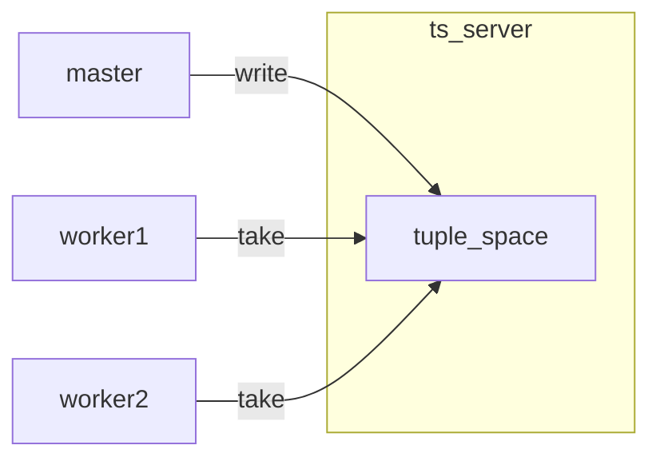
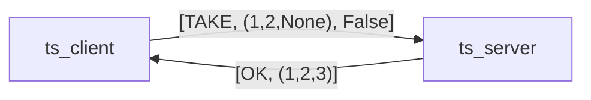

# Tuple spaces

This folder contains a very basic implementation of a tuple space server.



The implementation follows a basic client-server processing model:
a tuple space is a server process that can serve multiple client processes.
It responds to three kinds of commands:

  * write commands (the "out" operation of Linda): add tuples
  * take commands (the "in" operation of Linda): wait for matching tuple and remove it (only one taker)
  * read commands (the "rd" operation of Linda): wait for matching tuple without removing (potentially many readers)

The file `worker_example.py` shows how to use a tuple space to coordinate
the assignment of "work" from a master across a number of worker processes.

The file `event_example.py` shows how to use a tuple space to emit event
updates from a publisher to a number of subscriber processes.

### Tuple Space API

Create a tuple space client that connects to a tuple space server running on a given `host` and `port`:

```py
ts = TSClient(host, port)
```

The tuple space server stores an unordered set of "tuples".

A tuple in this API corresponds to a basic Python tuple, e.g. `(1,2,3)`.

To write a "tuple" to the shared tuple space:

```py
ts.write((1,2,3))
```

The write command does not return a value. When it returns the tuple is
stored on the server.

Take and read commands specify a "pattern" to match against all the tuples
in the tuple space. A "pattern" is also a basic Python tuple, but we treat
`None` values in the tuple as wildcards that can match any value. All other
values match based on Python's standard `==` equality. For example,
the pattern `(1,2,None)` matches the tuple `(1,2,3)`.

To "take" (remove) a tuple from the tuple space:

```py
tuple = ts.take((1,2,None))
```

A take command blocks until a matching tuple is available, removes it
from the tuple space and returns it to the caller.
The tuple space guarantees that at most one process will take the tuple.

Often the taking process is only interested in the value of the wildcards,
and you can rewrite the above to:

```py
_, _, x = ts.take((1,2,None))
# x will be 3
```

To "read" (copy) a tuple from the tuple space:

```py
tuple = ts.read((1,2,None))
```

A read command blocks the sending process until a matching tuple is available and returns a copy,
leaving the original tuple in the tuple space.

If we do not want to "block" the process that reads or takes a tuple when no matching tuple
is available, we can also "probe" the tuple space, by passing an optional `probe=True` flag:

```py
tuple = ts.read((1,2,None), probe=True)
if tuple is None:
    # no match
```

This makes the read or take command 'non-blocking': if no matching tuple is available now, the call returns immediately with a `None` value.
In terms of the original Linda tuple space, a call to `ts.take(pattern, probe=True)` corresponds to the "inp" operation
and a call to `ts.read(pattern, probe=True)` corresponds to Linda's "rdp" operation.

### Implementation details

The file `server.py` implements the tuple space server, storing all the tuples
and waiting for client requests.

The file `client.py` implements a client interface that hides the details of
the messaging protocol that tuple space client and server speak with each other.
For example, the call `ts.take((1,2,None))` generates the following
request-response interaction between client and server:



The client uses a ZeroMQ `REQ` socket, connected to a server `ROUTER` socket.
We use `ROUTER` sockets rather than `REP` sockets because we need the ability
to respond to earlier requests out-of-order. That is, sometimes we need to delay
responding to a "TAKE" request because no tuple is available. In this case we
store the identity of the sender and send a reply later.

The tuple space is implemented as a basic list. Take and read operations have
*O(n)* time complexity, with *n* the total number of tuples in the tuple space.
Write operations have *O(m)* time complexity, with *m* the total number of readers
or takers waiting for a matching tuple. We sacrifice efficiency for the sake
of simplicity.