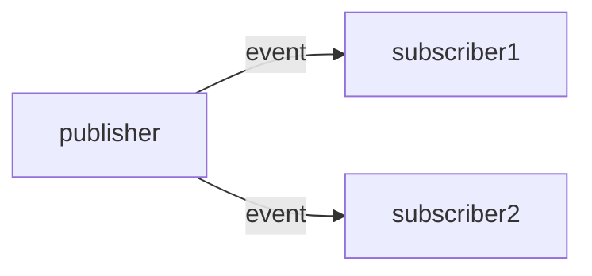

# Event notification

Example of the Event notification pattern using ZeroMQ sockets.

ZeroMQ supports a special type of socket called a `PUB-SUB` socket.

A single server periodically sends messages over a `PUB` socket that are automatically routed
to all connected subscribers.

Multiple clients can subscribe to the stream of messages via a `SUB` socket. The socket optionally
takes a prefix-string as argument, and only delivers messages that match the given prefix, filtering
out the rest.

In our example, a single server (the publisher) periodically publishes temperature readings from a sensor. Two clients (subscribers) connect to the server to listen for temperature updates. In a real system, one subscriber could be a sprinkler system that automatically activates sprinklers if the temperature is too high. Another subscriber could be a monitoring server that serves a dashboard to a human operator.

## Event notification vs "Publish-subscribe"

This pattern is very similar to "publish-subscribe" discussed below (and ZeroMQ even uses these terms as part of its API). The main differences with the pub-sub pattern discussed below is:

  * In basic event notification, messages are transient. If subscribers disconnect and later reconnect, they may have missed any updates sent while they were disconnected. If the publisher crashes, in-transit messages are not replayed. Publisher and subscriber must both be online at the same time, they are not decoupled in time.

  * In basic event notification, while one-to-many interaction is supported, the clients all still directly connect to a known server via shared configuration (e.g. machine hostname and port details). In this sense, publisher and subscribers are not decoupled in space.

## A note on terminology

As you have probably guess from the `PUB` and `SUB` socket types, ZeroMQ refers to this pattern simply as ["publish-subscribe"](https://learning-0mq-with-pyzmq.readthedocs.io/en/latest/pyzmq/patterns/pubsub.html) rather than "event notification".

For the purposes of this lecture, we use the term "event notification" specifically to denote a communication pattern where publishers and subscribers are directly connected to one another, as is the case with ZeroMQ. Be aware that in practice people may still use the term "pub-sub" even when not using a message broker.
