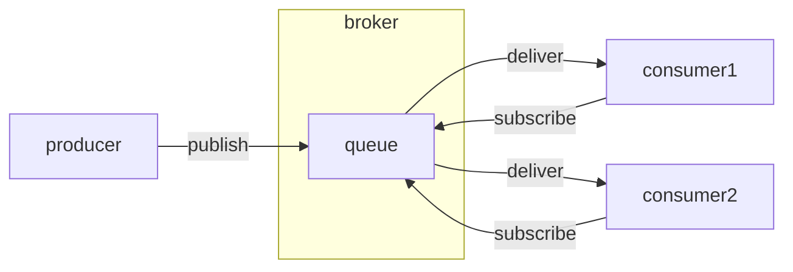

# Message Queue

An example of message queuing using the RabbitMQ message broker.

> **_NOTE:_** This code assumes RabbitMQ is running as a separate process on your machine.

The example used is that of a very basic food delivery app:

  * A single message queue is created in the broker to keep track of outstanding food deliveries.

  * A producer publishes confirmed food delivery orders to the queue (e.g. in a real system this could be the cloud server of a food delivery app).
  
  * Two consumers subscribe to the shared queue and consume the orders (in a real system these could be running on the mobile apps of delivery riders working for the food delivery platform).

## Message queuing versus Pipeline pattern

The pattern is very similar to the pipeline pattern discussed elsewhere, except:

  * In this case, the producer and the consumers do not need to know about each other. Instead, as long as they all connect to the same broker (RabbitMQ server), they can interact. (Note that producer and consumers still share a configuration file storing the connection details for the shared broker and queue name.)

  * In this case, producer and consumers must not both be connected at the same time. The producer can enqueue the orders and go offline. Late consumers are still able to pick up work that was enqueued in the past.

  * In this case, if consumers fail while processing the task, the message will stay enqueued in the shared queue and can either be picked up by other consumers, or can be re-executed by a crashed consumer on reconnect.

## Learn more

The worker pattern using message queues is explained in more detail [here](https://www.rabbitmq.com/tutorials/tutorial-two-python.html) Beware: they use a different Python client library (`pika` instead of `rabbitpy`) with a different client API.