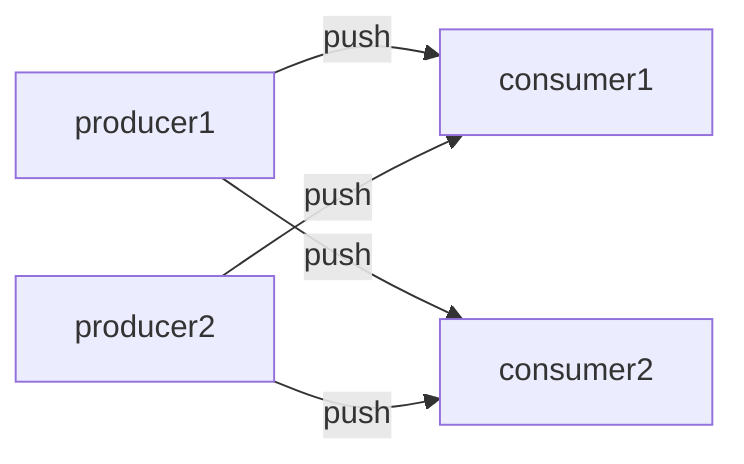

# Pipeline

An example of the pipeline (a.k.a. push-pull) pattern using ZeroMQ sockets.

For more details about the pattern, see [ZeroMQ's documentation](https://learning-0mq-with-pyzmq.readthedocs.io/en/latest/pyzmq/patterns/pushpull.html).

It uses ZeroMQ PUSH and PULL sockets:

Producers can push "work" (or a description of work to be done) on a PUSH socket, blocking until a worker is available. If multiple PULL peers are connected to the PUSH socket, the work is spread evenly among these consumer peers.

Consumers can pull for "work" on a PULL socket, blocking until work is available. If multiple PUSH peers are connected to the PULL socket, work will be pulled from all producer peers using a fair queueing strategy.

PUSH-PULL sockets support many-to-many communication between multiple work producers and consumers. This is often ideal for load-balancing the execution of independent computationally heavy tasks across many worker machines.

The file `run.py` launches 10 workers (consumers) and 1 producer and demonstrates how the "work" gets distributed over the workers. We simulate a worker doing useful work by letting it sleep for a random amount of time.

The files `producer.py` and `consumer.py` implement part of a workflow of a food delivery app. Producers push confirmed food delivery orders via a PUSH socket (e.g. in a real system this could be the cloud server of a food delivery app). Consumers connect to one or more producers to process the posted orders (in a real system these could be running on the mobile apps of delivery riders working for the food delivery platform). Note: the scripts `producer.y` and `consumer.py` are meant to be launched as processes in a separate terminal.

## Pipeline versus Message Queueing

This pattern is very similar to the "message queueing" pattern discussed elsewhere, except:

  * In the pipeline pattern, messages are *transient*. If the producer crashes, in-transit messages are not replayed. Producer and consumer must both be online at the same time, they are not decoupled in time. In our message queueing example, messages are *persistent* instead.

  * In the pipeline pattern, while many-to-many interaction is supported, the consumers still directly connect to one or more known producers via shared configuration (e.g. machine hostname and port details). In this sense, producer and consumer are not decoupled in space. The message queueing example uses a message broker to decouple producer and consumer.